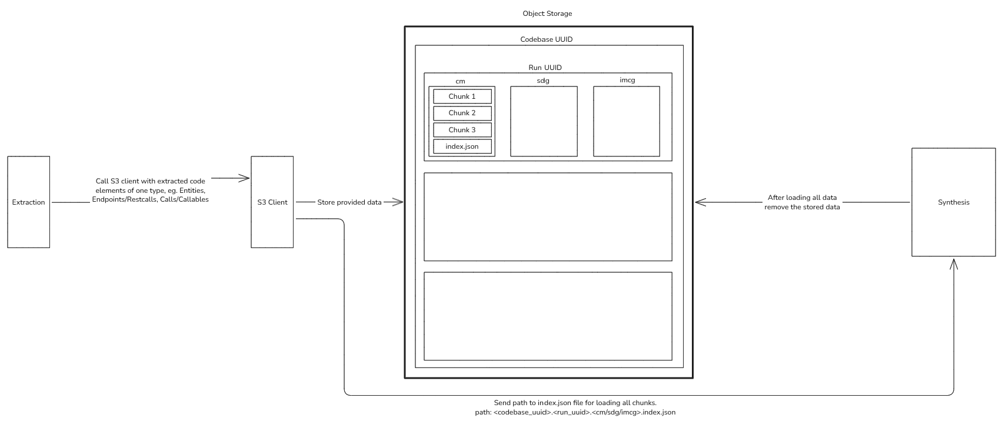

# Problem

We need that of the particular codebase all elements are extracted and then send to synthesizer.
Due to how synthesizing algorithms work, this needs to be done in a way that synthesizer has all necessary code elements at once.
Sending the extracted data in one API call is not optimal.

# Solution

We want to start with a streaming/batching approach to send all the data from extractor to synthesizer via stream/batches. This should be better then sending one request with huge amount of data.

# Alternative

Another way is to make the synthesizing algorithms work without complete data (all extracted code elements).

# Investigated Solution - Preffered

The extraction can gradually store extracted data into a object storage. After the whole extraction is done, extractor sends just the place of the stored data. Synthesizer then loads the data and synthesizes views.

## SeaweedFS

Seems like the best fit. It is free to use (even for commercial usage). Has S3 gateaway so in Rust you need only s3 crate

## Tasks

- Implement Client on the Extractor side for storing extracted data.
- Implement object key logic.
- Implement REST API for getting object keys -> needs to redo synthesizer endpoints.
- Implement deletion of extracted elements that were synthesized -> Implement Client on the Synthesizer side.

## How to store extracted code elements within the same object/module

There are 3 options:

1. Store each extracted code element as a separate .json file.
2. Everytime you want to store new extracted code element, laod the .json file and add the extracted code element to it.
3. Store chunks of the extracted code elements, for example one file = one chunk. Create an index file to be able to load chunks into one cohesive object for better synthesizing.

From those option, Option n.3 seems the best. It provides optimal storing and with an index file also optimal loading into single object.

## Illustration

